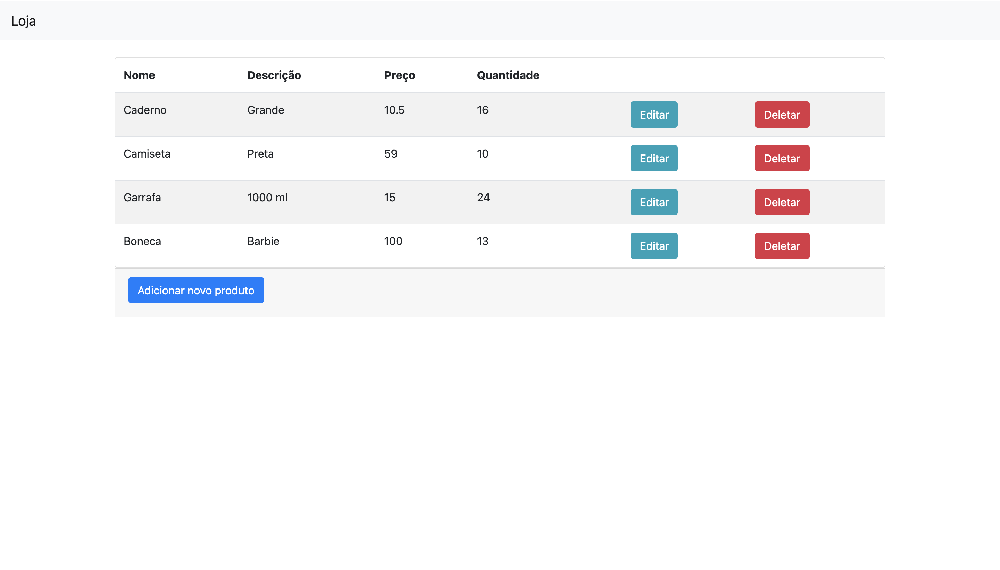
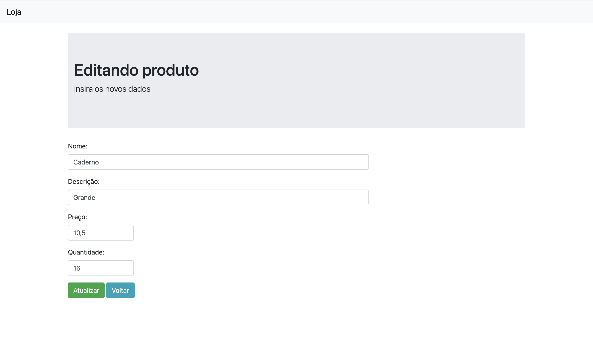
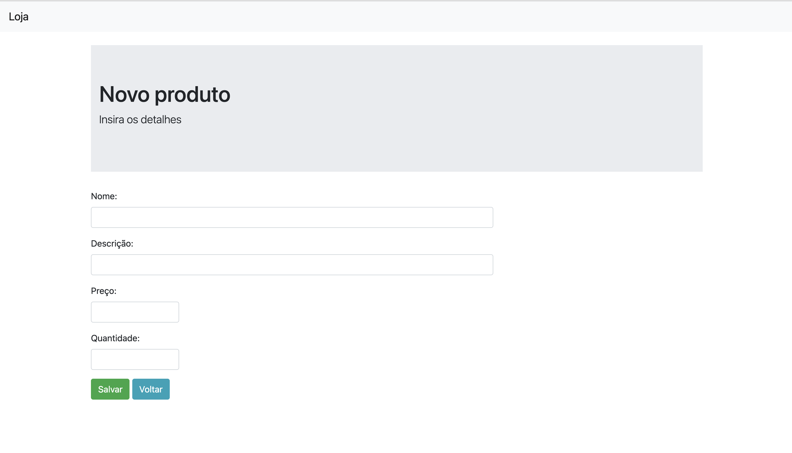

<h1 align="center">🔗Aplicação Web com Go</h1>

Aplicação Web conectada com banco de dados que possibilita adicionar, editar e excluir produtos

<h4 align="center"> 
	🚧  🚀 Concluido...  🚧
</h4>

### Features

- [x] Cadastro de produtos
- [x] Edição de produtos
- [x] Exclução de produtos

<h1 align="center">
  
</h1>
<h1 align="center">
  
</h1>
<h1 align="center">
  
</h1>
